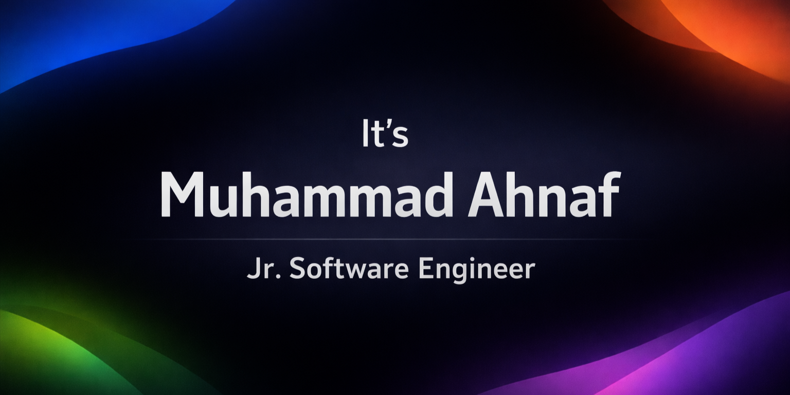

  

## [👤] Who Am I?

<!-- Howdy! I'm **Ahnaf**, A Software Developer who actually cares about how code feels to write and how apps feel to use. I’m deep into the **TypeScript** ecosystem, usually wrangling **Next.js**, **Express.js**, **Prisma**, and **Postgres**. I’m big on "No-BS" engineering: if it’s not scalable, type-safe, and performant, what’s the point? When I'm not staring at a terminal, I'm probably catching up on **Anime** or traveling to refresh my head. I’m naturally analytical about random stuff, which is a blessing for debugging, but a curse for everything else. -->

Howdy! I'm **Ahnaf**, A Software Developer. I build full-stack web and mobile applications using **TypeScript, Next.js, Express.js, and Prisma**. My work focuses on system performance, data integrity, and user interface design. Outside of development, I spend time watching **Anime**. I have an analytical approach to problem-solving and a strong interest in improving the developer experience within codebases. Currently expanding my technical stack to include Go and Docker containerization.

---

## [🧰] Technical Toolkit

---

## [🫱🏼‍🫲🏼] Let's Connect

## [🏆] Competitive Programming

---

## [📄] Quote of the Day

